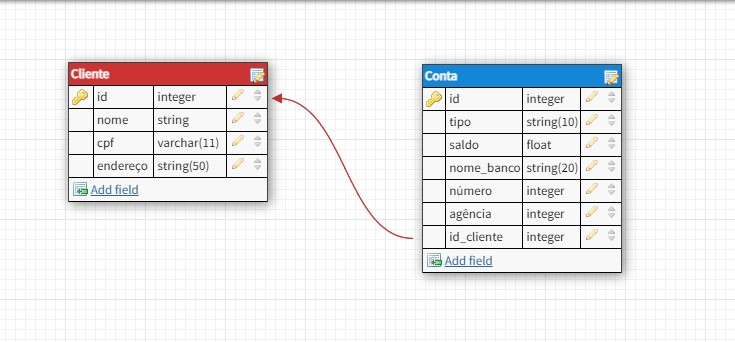

# 💻 Integração de Python com SQLite e MongoDB 💻

>"Faça o teu melhor, na condição que você tem, enquanto você não tem condições melhores, para fazer melhor ainda!"
<!-- Mario Sergio Cortella  --> 

## _*Projeto Desafio Integrando sqllite e mongodb*_
Neste desafio DIO foi realizada a implementação de uma aplicação de integração com SQLite com base em um esquema relacional dentro do contexto de cliente e conta para criar as classes de sua API. As classes representaram as tabelas do banco de dados relacional dentro da aplicação.

### 🔧 FUNCIONALIDADES

 
<strong>Parte 1 - </strong>Implementando um Banco de Dados Relacional com SQLAlchemy

  <ul>
    <li>Aplicação com a definição do esquema por meio das classes usando SQLAlchemy</li>
    <li>Inserção de um conjunto de dados mínimo para manipulação das informações</li>
    <li>Execução de métodos de recuperação de dados via SQLAlchemy</li>
  </ul>

   
  
<strong>Parte 2 - </strong>Implementando um Banco de Dados NoSQL com pymongo

  <ul>
    <li>Conectar ao mongo atlas e crie um banco de dados</li>
    <li>Definir uma coleção bank para criar os documentos de clientes</li>
    <li>Inserir documentos com a estrutura mencionada</li>
    <li>Escrever instruções de recuperação de informações com base nos pares de chave e valor</li>
  </ul>

#### 📌 Echema Relacional

    
  

### _*Meta concluída*_ 
1. Desafio de Projeto 
- [X] Done! :🚀👩‍💻

[^1]: Este Projeto tem como objetivo treinar os códigos em Python e ser acrescentado ao Portfólio.
